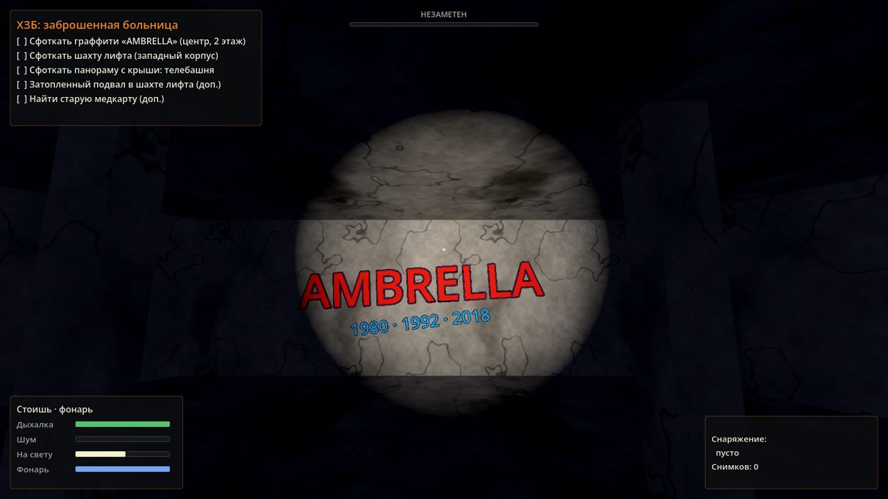
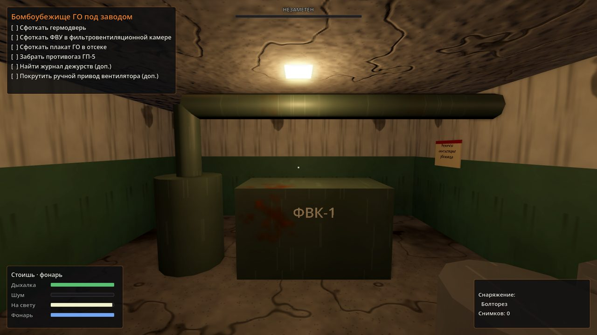
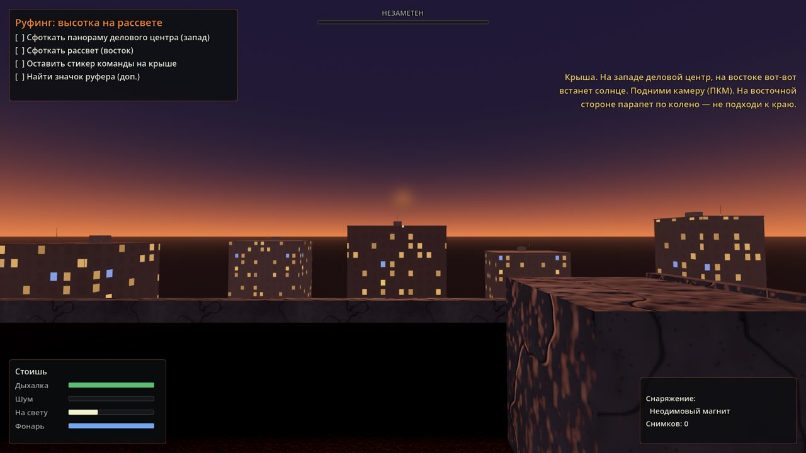

# Urbex Simulator

Стелс-симулятор городского исследователя на Godot 4 и C++ (GDExtension). Три объекта по мотивам реального российского урбекса: заброшенная больница, бомбоубежище гражданской обороны и руфинг на жилой высотке. Охрана ЧОП, консьержка, ГБР по сработке, датчики движения, лучевые ИК-барьеры, герконы на дверях, вибродатчики на заборах и камеры.

Вся логика, генерация уровней, текстуры и звуки написаны на C++. Внешних ассетов нет: текстуры бетона, кирпича, кафеля и фасадов генерируются процедурно, звуки шагов, скрипа гермодвери, звонка сигнализации и сирены синтезируются при запуске.


## Объекты

**ХЗБ: заброшенная больница.** Недострой в форме трёхлучевой звезды по мотивам Ховринской больницы. Три корпуса по три этажа, дыры в перекрытиях, открытая шахта лифта с затопленным приямком, крыша с видом на телебашню. Вахтёр на КПП, обходчик по периметру, охранник внутри. ИК-барьер на главном входе, камера на воротах, вибродатчик на новом заборе. Питание сигнализации идёт от щитка на КПП — его можно обесточить.



**Бомбоубежище ГО под заводом.** Павильон входа, две гермодвери с кремальерами и тамбур-шлюз, фильтровентиляционная камера с ФВК-1 и фильтрами ФП-100, дизельная, отсеки с двухъярусными нарами и плакатами ГО, склад, медпункт. Второй путь — оголовок аварийного выхода, шахта со скобами и тоннель. На внешней гермодвери геркон, в коридоре датчики движения, всё питается от главного щита в дизельной.



**Руфинг: высотка на рассвете.** Двенадцатиэтажная башня в закрытом ЖК. Дверь на домофоне — ждёшь жильца и проскакиваешь. Консьержка за стеклом то смотрит на вход, то в телевизор. Свет в подъезде на датчиках движения. Ключи от чердака в электрощитке на 12 этаже, дверь техэтажа на герконе, на кровле камера управляющей компании. Наверху — панорама делового центра и рассвет.



## Механики

- **Шум.** Бег слышно метров за 13, шаг за 6, присед за 2, крадущийся шаг почти не слышно. Битое стекло удваивает шум. Двери скрипят, гермодверь слышно на весь бункер, болторез — громко.
- **Свет.** Охрана видит тебя тем дальше, чем больше ты освещён: фонари, лампы, собственный фонарик, луч фонаря охранника. В темноте заметят только вблизи.
- **Охрана ЧОП.** Патруль, подозрение (?), проверка шума, погоня (!), поиск, возвращение на маршрут. Охранники переговариваются по рации и сбегаются на сработку. Задержание — конец вылазки.
- **Тревога и ГБР.** Любая сработка — сигнализация, через минуту приезжает группа быстрого реагирования и прочёсывает объект.
- **Датчики.**
  - Пассивный ИК-извещатель реагирует на движение поперёк зон. Двигаться прямо на датчик или от него почти безопасно. Мигает зелёным — живой, не мигает — мёртвый.
  - Лучевой ИК-барьер: красная нить, пересечь нельзя, можно проползти под ней.
  - Геркон ИО 102 на двери: открыл — тревога. Неодимовый магнит на датчик — и можно открывать.
  - Вибродатчик на заборе: перелез — тревога.
  - Камеры видят в ИК-подсветке и следят за тобой, муляжи не крутятся.
- **Питание.** Щиток можно обесточить: гаснут свет и датчики на линии, но охранник пойдёт проверять.
- **Фото.** Камера телефона: цели засчитываются только если объект в кадре и в прямой видимости.
- **Опасности.** Падение с двух этажей и выше смертельно. Шахты, дыры, край крыши.
- **Фонарик** садится, батарейки можно найти на объектах.
- **Итоги вылазки:** время, кадры, артефакты, сработки, «лайки в паблике», лучший результат сохраняется.

## Управление

| Клавиша | Действие |
| --- | --- |
| W A S D | движение (физические клавиши, работает на русской раскладке) |
| Shift | бег |
| C / Ctrl | присесть (переключатель / удерживать) |
| Alt или Z | красться |
| Пробел | прыжок |
| F | фонарик |
| E | взаимодействие |
| ПКМ или Q | поднять камеру, ЛКМ — снимок |
| Esc | пауза |

## Сборка

Нужно: Godot 4.5 или новее, Python 3, SCons (`pip install scons`) и компилятор C++17 (Visual Studio Build Tools на Windows, GCC/Clang на Linux, Xcode на macOS).

```bash
git clone --recursive https://github.com/skibididobdob228/Urbex-Simulator.git
cd Urbex-Simulator
scons platform=windows target=template_debug    # или linux / macos
```

Библиотека появится в `project/bin/`. После этого открой папку `project/` в Godot и нажми F5.

Если не хочется ставить компилятор: GitHub Actions собирает библиотеки для Windows, Linux и macOS на каждый пуш. Артефакт `Urbex-Simulator-project` — это готовая папка проекта со всеми библиотеками, её можно сразу открыть в Godot.

Для экспорта в exe собери ещё `target=template_release` и экспортируй проект штатно через Project → Export.

## Структура

```
src/
  core/       игра, конструктор уровней, процедурные материалы и звуки
  actors/     игрок, охрана ЧОП/ГБР/консьержка, модели людей
  security/   датчики движения, ИК-барьеры, камеры, точки для фото
  world/      двери (обычные, гермодвери, люки, ворота), предметы, щитки, лестницы
  ui/         HUD, меню, пауза, итоги
  levels/     три уровня и общие заготовки
project/      проект Godot
godot-cpp/    сабмодуль с привязками C++
```

## Отладочные флаги

Для автотестов без рук игра понимает аргументы после `--`:

```bash
godot --headless --path project -- --autotest=hospital        # загрузить уровень, проверить навмеш, маршруты, точки для фото
godot --path project -- --autotest=shelter --shot=out.png --pos=-3,-5.9,0.4 --yaw=180 --light
```

## Что использовано из реальности

- Ховринская больница: строительство с 1980 года, заморожена в 1992-м, форма трёхлучевой звезды, прозвища «Амбрелла» и «Нимостор», затопленные подвалы, забор с 2009 года, охрана с 2011-го, снос в 2018-м.
- Убежища ГО: защитно-герметические двери, тамбур-шлюз, ФВК, ДЭС, три режима вентиляции, ФВК-1 на 150 человек, фильтры-поглотители ФП-100/ФП-300.
- Ст. 20.17 КоАП РФ (штраф 3–5 тысяч рублей или обязательные работы за проникновение на охраняемый объект), ст. 7.17 КоАП РФ (повреждение имущества), права охранника ЧОП (задержать и передать полиции).
- Извещатели: магнитоконтактный ИО 102 (геркон), пассивные ИК «Астра», «Фотон», лучевые барьеры, вибрационный «Шорох-2».

Источники: ru.wikipedia.org (Ховринская больница), omchs-rezerv.ru (режимы работы ЗС ГО), npp-cso.ru (ФВК-1), КоАП РФ ст. 20.17 и 7.17, tinko.ru и shop.bolid.ru (ИО 102), signalkaman.ru (вибрационные извещатели), РИА Недвижимость и Lenta.ru (ответственность руферов).

Игра не призывает лезть на охраняемые объекты. В реальности это штрафы, а падения с высоты убивают.

## Лицензия

GPL-3.0, см. [LICENSE](LICENSE).
