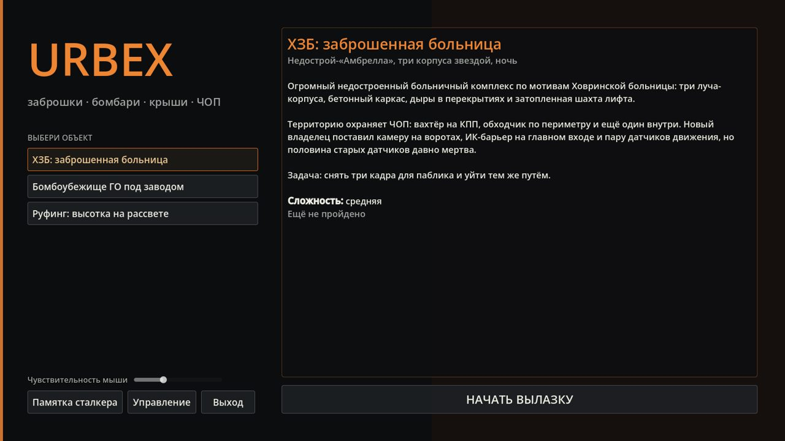
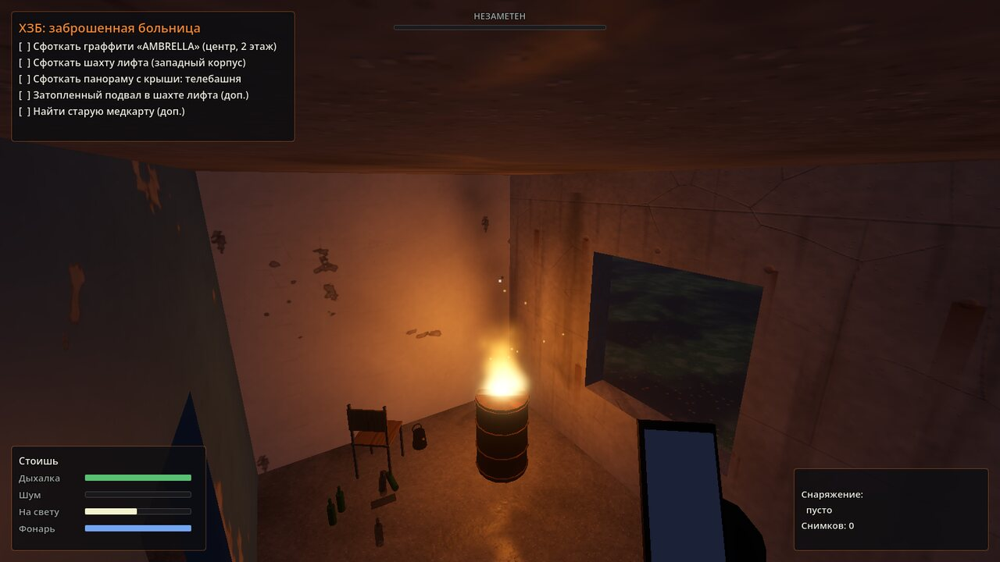
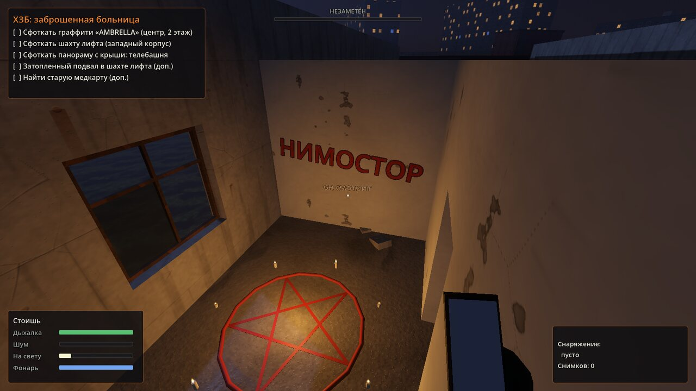
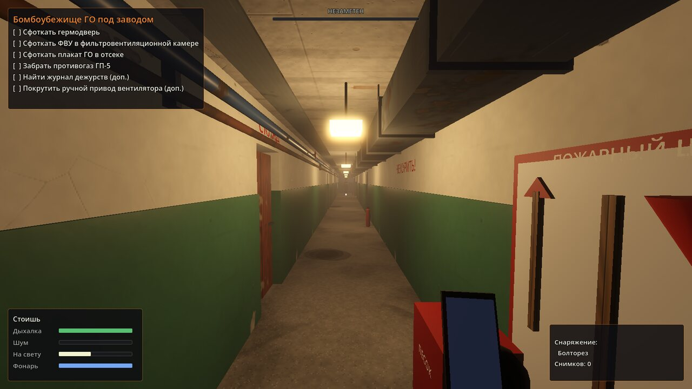
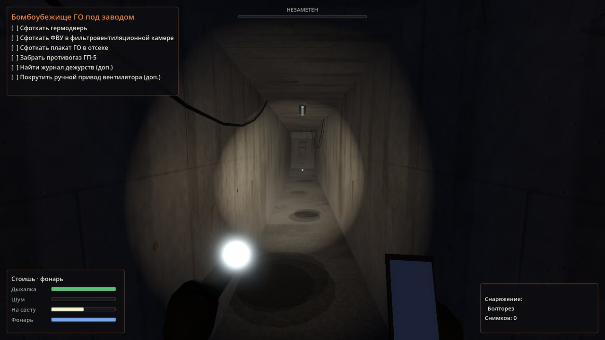
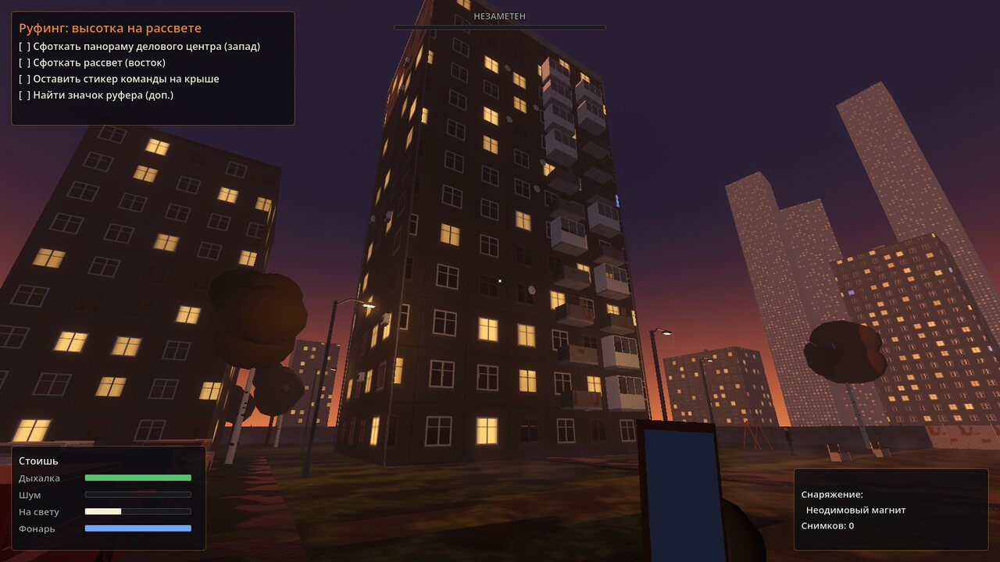
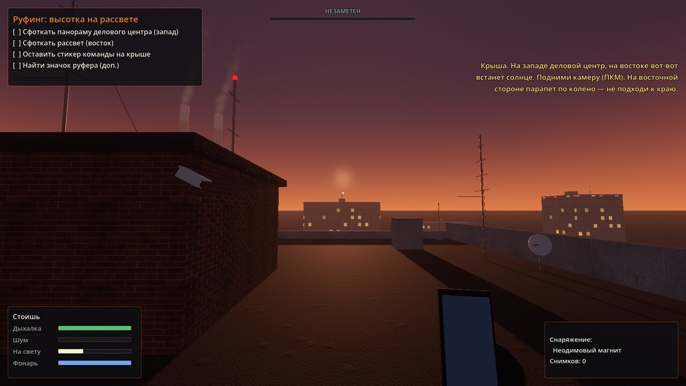
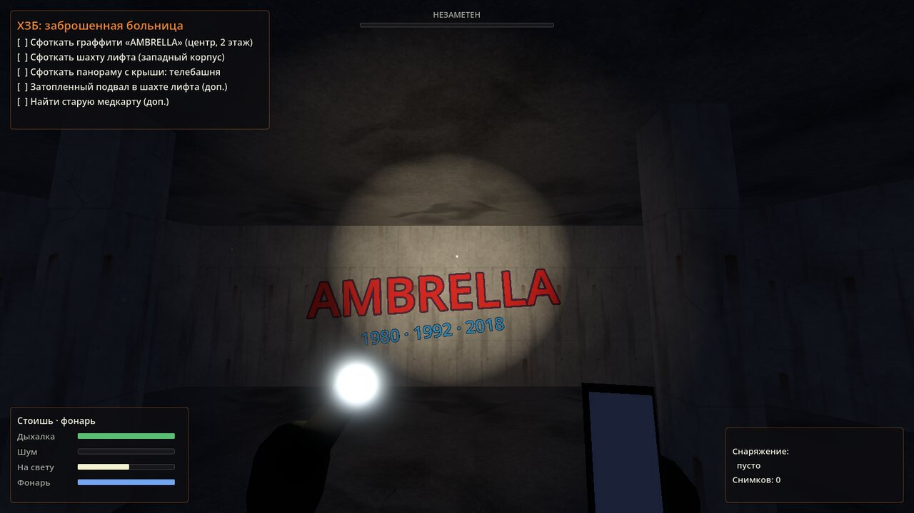
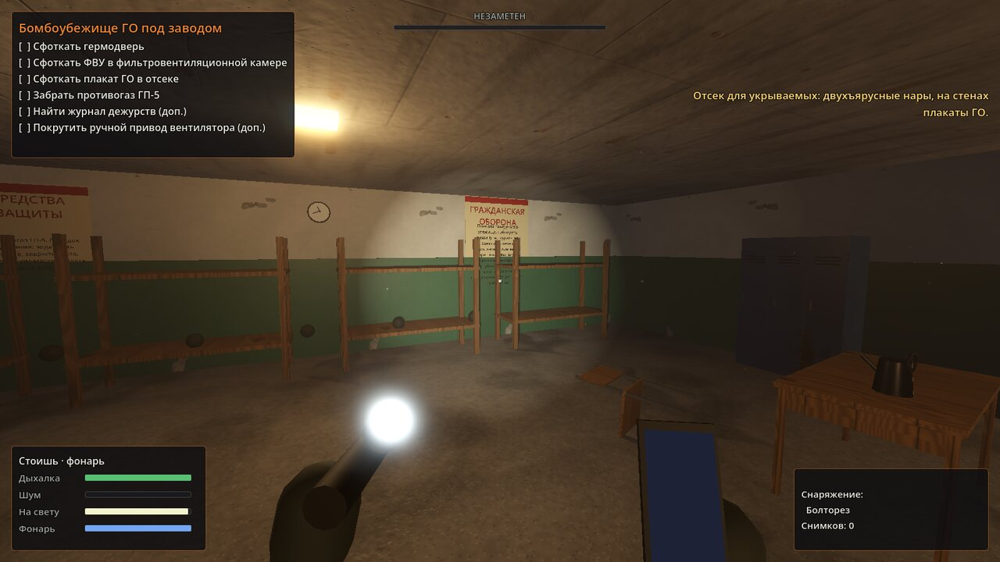
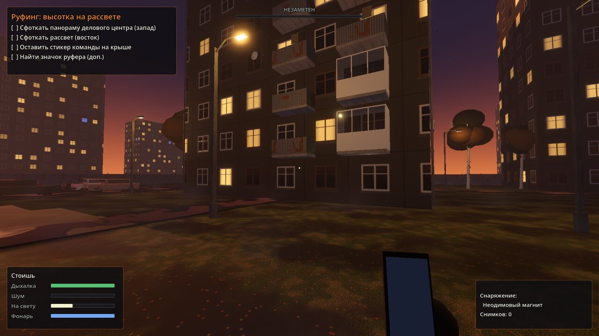

# Urbex Simulator

Стелс-симулятор городского исследователя на Godot 4 и C++ (GDExtension). Три объекта по мотивам реального российского урбекса: заброшенная больница, бомбоубежище гражданской обороны и руфинг на жилой высотке. Охрана ЧОП, консьержка, ГБР по сработке, датчики движения, лучевые ИК-барьеры, герконы на дверях, вибродатчики на заборах и камеры.

Вся логика, генерация уровней, модели, текстуры, частицы и звуки написаны на C++. Внешних ассетов нет: текстуры бетона с опалубкой и ржавыми потёками, облупленной краски, кирпича, кафеля, бетонного забора «ромашка» и фасадов генерируются процедурно вместе с картами нормалей и шероховатости, звуки шагов, скрипа гермодвери, гудения ламп, треска костра, звонка сигнализации и сирены синтезируются при запуске.



## Объекты

**ХЗБ: заброшенная больница.** Недострой в форме трёхлучевой звезды по мотивам Ховринской больницы. Три корпуса по три этажа, дыры в перекрытиях с торчащей арматурой, открытая шахта лифта с затопленным приямком, крыша с видом на телебашню. Ржавые койки, каталки и кресла-каталки, шкафы с бумагами, остатки рам, провода с потолка. В одной из палат стоянка бомжей с костром в бочке, на третьем этаже южного корпуса ритуальный круг «Нимостор» со свечами. Вахтёр на КПП, обходчик по периметру, охранник внутри. ИК-барьер на главном входе, камера на воротах, вибродатчик на новом заборе. Питание сигнализации идёт от щитка на КПП — его можно обесточить.





**Бомбоубежище ГО под заводом.** Павильон входа, две гермодвери с кремальерами в стальных рамах и тамбур-шлюз, фильтровентиляционная камера с ФВК-1 и фильтрами ФП-100, дизельная с искрящим главным щитом, пункт управления с радиостанцией и телефоном, отсеки с двухъярусными нарами, баками «ВОДА ПИТЬЕВАЯ» и плакатами ГО, склад с ящиками ГП-5, медпункт, санузел. По потолку коридора идут вентиляционный короб, кабельные лотки и трубы с вентилями, из одной бьёт пар. Второй путь — оголовок аварийного выхода, шахта со скобами и сырой тоннель с мигающей лампой. На внешней гермодвери геркон, в коридоре датчики движения, всё питается от главного щита в дизельной. Наверху заводской двор: бетонный забор «ромашка», контейнеры, грузовик, дымящая труба.





**Руфинг: высотка на рассвете.** Двенадцатиэтажная башня в закрытом ЖК: застеклённые и открытые балконы с бельём, кондиционеры, тарелки, водостоки. Во дворе машины, детская площадка, лавочки, мусорные баки, берёзы. Дверь на домофоне — ждёшь жильца и проскакиваешь. Консьержка за стеклом то смотрит на вход, то в телевизор. Свет в подъезде на датчиках движения, на площадках мусоропровод, батареи и электрощитки. Ключи от чердака в щитке на 12 этаже, дверь техэтажа на герконе, на кровле камера управляющей компании, антенны и пар из вентшахт. Наверху — панорама делового центра, трубы ТЭЦ и рассвет.





## Атмосфера

- Пыль висит в воздухе и видна только в луче фонаря.
- Капли с потолка с брызгами и лужами, пар из пробитой трубы, низкий туман в тоннеле и над пустырём.
- Огонь, искры и дым над бочкой, свечи, мотыльки у фонарей, листопад, стаи птиц над городом, дым из труб ТЭЦ.
- Мигающие люминесцентные лампы с гудением, искрящая проводка у щитков, осыпающаяся с потолка штукатурка.
- Подтёки, копоть и мокрые пятна (декали, видны в Forward+).
- По тревоге загораются маячки, а ГБР приезжает на фургоне с мигалкой.
- Модели людей: охрана ЧОП в кепке с рацией и дубинкой, ГБР в шлемах и разгрузках, консьержка в очках и шарфе. У игрока в руках телефон и фонарь.

## Механики

- **Шум.** Бег слышно метров за 13, шаг за 6, присед за 2, крадущийся шаг почти не слышно. Битое стекло удваивает шум. Двери скрипят, гермодверь слышно на весь бункер, болторез — громко.
- **Свет.** Охрана видит тебя тем дальше, чем больше ты освещён: фонари, лампы, собственный фонарик, луч фонаря охранника. В темноте заметят только вблизи.
- **Охрана ЧОП.** Патруль, подозрение (?), проверка шума, погоня (!), поиск, возвращение на маршрут. Охранники переговариваются по рации и сбегаются на сработку. Задержание — конец вылазки.
- **Тревога и ГБР.** Любая сработка — сигнализация, через минуту приезжает группа быстрого реагирования и прочёсывает объект.
- **Датчики.**
  - Пассивный ИК-извещатель реагирует на движение поперёк зон. Двигаться прямо на датчик или от него почти безопасно. Мигает зелёным — живой, не мигает — мёртвый.
  - Лучевой ИК-барьер: красная нить, пересечь нельзя, можно проползти под ней.
  - Геркон ИО 102 на двери: открыл — тревога. Неодимовый магнит на датчик — и можно открывать.
  - Вибродатчик на заборе: перелез — тревога.
  - Камеры видят в ИК-подсветке и следят за тобой, муляжи не крутятся.
- **Питание.** Щиток можно обесточить: гаснут свет и датчики на линии, но охранник пойдёт проверять.
- **Фото.** Камера телефона: цели засчитываются только если объект в кадре и в прямой видимости. Вспышка (V) делает кадр ярче, но её видно и слышно издалека.
- **Опасности.** Падение с двух этажей и выше смертельно. Шахты, дыры, край крыши.
- **Фонарик** садится, батарейки можно найти на объектах.
- **Итоги вылазки:** время, кадры, артефакты, сработки, «лайки в паблике», лучший результат сохраняется.

## Управление

| Клавиша | Действие |
| --- | --- |
| W A S D | движение (физические клавиши, работает на русской раскладке) |
| Shift | бег |
| C / Ctrl | присесть (переключатель / удерживать) |
| Alt или Z | красться |
| Пробел | прыжок |
| F | фонарик |
| E | взаимодействие |
| ПКМ или Q | поднять камеру, ЛКМ — снимок |
| V | вспышка камеры вкл/выкл |
| Esc | пауза |

## Сборка

Нужно: Godot 4.5 или новее, Python 3, SCons (`pip install scons`) и компилятор C++17 (Visual Studio Build Tools на Windows, GCC/Clang на Linux, Xcode на macOS).

```bash
git clone --recursive https://github.com/skibididobdob228/Urbex-Simulator.git
cd Urbex-Simulator
scons platform=windows target=template_debug    # или linux / macos
```

Библиотека появится в `project/bin/`. После этого открой папку `project/` в Godot и нажми F5.

Если не хочется ставить компилятор: GitHub Actions собирает библиотеки для Windows, Linux и macOS на каждый пуш. Артефакт `Urbex-Simulator-project` — это готовая папка проекта со всеми библиотеками, её можно сразу открыть в Godot.

Для экспорта в exe собери ещё `target=template_release` и экспортируй проект штатно через Project → Export.

### Arch Linux

```bash
sudo pacman -Syu --needed base-devel git python scons godot
git clone --recursive https://github.com/skibididobdob228/Urbex-Simulator.git
cd Urbex-Simulator
scons platform=linux target=template_debug -j"$(nproc)"
godot --path project
```

Редактор: `godot -e --path project`. Если клонировал без `--recursive`, сначала выполни `git submodule update --init --recursive`. Release-библиотека для экспорта: `scons platform=linux target=template_release -j"$(nproc)"`.

## Тесты

`tests/run_selftest.sh` собирает библиотеку и прогоняет самотест в headless-режиме: все три уровня по очереди, около 580 проверок.

- навмеш, маршруты охраны и точки обыска ГБР достижимы;
- в каждую дверь, предмет, щиток, лестницу и записку можно прицелиться с пола;
- предметы подбираются, двери открываются ключами и болторезом, геркон поднимает тревогу, а с магнитом молчит;
- щитки гасят свет и датчики и включают обратно, лестницы и заборы переносят игрока куда надо;
- каждую фото-цель можно снять из доступной точки, выход засчитывает победу и сохраняет рекорд;
- тревога вызывает ГБР, ГБР ходят по навмешу и ловят игрока, падение с высоты убивает, пауза и выход в меню работают;
- любые ошибки и предупреждения движка во время прогона считаются провалом, утечки объектов при выходе тоже.

```bash
tests/run_selftest.sh                       # собрать и проверить все уровни
tests/run_selftest.sh --levels=shelter      # только один уровень
tests/run_selftest.sh --asan                # то же под AddressSanitizer и UBSan
GODOT=/путь/к/godot tests/run_selftest.sh --no-build
```

Самотест работает с отдельным файлом сохранений и не трогает твои рекорды. В GitHub Actions он запускается на Godot 4.5 и 4.7.2.

## Структура

```
src/
  core/       игра, конструктор уровней, реквизит, частицы и эффекты, процедурные материалы и звуки
  actors/     игрок, охрана ЧОП/ГБР/консьержка, модели людей
  security/   датчики движения, ИК-барьеры, камеры, точки для фото
  world/      двери (обычные, гермодвери, люки, ворота), предметы, щитки, лестницы
  ui/         HUD, меню, пауза, итоги
  levels/     три уровня и общие заготовки
project/      проект Godot
godot-cpp/    сабмодуль с привязками C++
tests/        запуск самотеста
```

## Отладочные флаги

Для автотестов без рук игра понимает аргументы после `--`:

```bash
godot --headless --fixed-fps 60 --path project -- --selftest   # полный самотест, код возврата 0 или 1
godot --headless --path project -- --autotest=hospital        # загрузить уровень, проверить навмеш, маршруты, точки для фото
godot --path project -- --autotest=shelter --shot=out.png --pos=-3,-5.9,0.4 --yaw=180 --light
```

## Галерея







## Что использовано из реальности

- Ховринская больница: строительство с 1980 года, заморожена в 1992-м, форма трёхлучевой звезды, прозвища «Амбрелла» и «Нимостор», затопленные подвалы, забор с 2009 года, охрана с 2011-го, снос в 2018-м.
- Убежища ГО: защитно-герметические двери, тамбур-шлюз, ФВК, ДЭС, три режима вентиляции, ФВК-1 на 150 человек, фильтры-поглотители ФП-100/ФП-300.
- Ст. 20.17 КоАП РФ (штраф 3–5 тысяч рублей или обязательные работы за проникновение на охраняемый объект), ст. 7.17 КоАП РФ (повреждение имущества), права охранника ЧОП (задержать и передать полиции).
- Извещатели: магнитоконтактный ИО 102 (геркон), пассивные ИК «Астра», «Фотон», лучевые барьеры, вибрационный «Шорох-2».

Источники: ru.wikipedia.org (Ховринская больница), omchs-rezerv.ru (режимы работы ЗС ГО), npp-cso.ru (ФВК-1), КоАП РФ ст. 20.17 и 7.17, tinko.ru и shop.bolid.ru (ИО 102), signalkaman.ru (вибрационные извещатели), РИА Недвижимость и Lenta.ru (ответственность руферов).

Игра не призывает лезть на охраняемые объекты. В реальности это штрафы, а падения с высоты убивают.

## Лицензия

GPL-3.0, см. [LICENSE](LICENSE).
